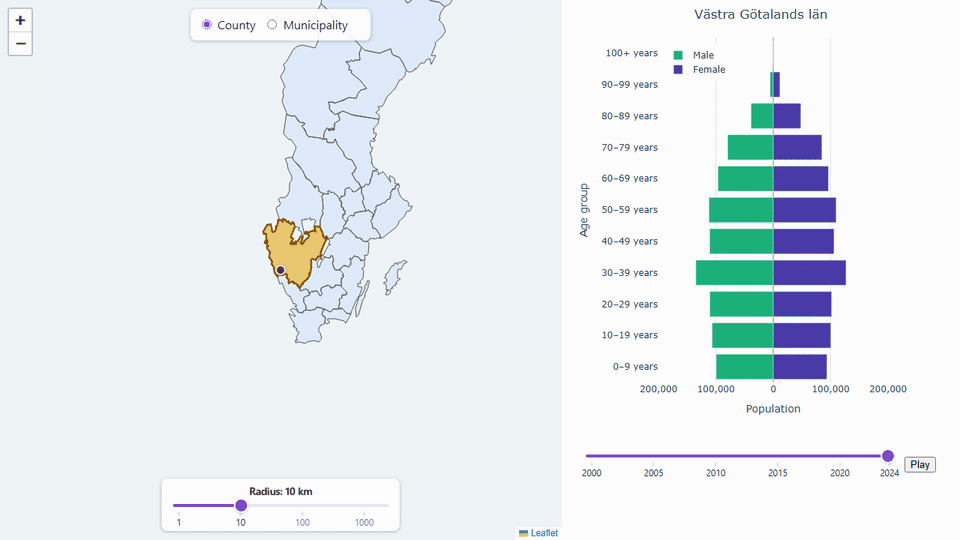

# Sweden Population Explorer

This is a personal project to gain hands-on experience with the full lifecycle of a data project: pulling real-world data from a public API, cleaning and storing it in a relational database, and building an interactive application to explore it geographically. It's achieved by working with Statistics Sweden's (SCB) open population statistics (covering every Swedish municipality, by age and sex, from 2000 onward) through a Python/PostgreSQL pipeline and a Dash/Leaflet web application built on top of it.

This project was developed with the assistance of Claude Code.



## Current pipeline

```text
SCB API
   │
   ▼
Python / pandas
   │
   ├── JSON-stat parsing
   ├── Data cleaning
   └── API request batching
   │
   ▼
PostgreSQL
   │
   ├── SQL queries
   │
   ▼
Analysis
   │
   ▼
Interactive Dash app
```

The current dataset contains monthly population data by Swedish municipality, age group and sex.

The project also includes municipality geometry data in GeoJSON format, which is used to connect population data to geographic locations.

## Technologies

* Python
* pandas
* Dash / dash-leaflet
* Plotly
* Shapely
* PostgreSQL
* psycopg
* pytest
* Docker
* GitHub Actions

## Project structure

```text
scb-project/
├── .github/
│   └── workflows/
│       └── ci.yml
├── assets/
│   └── layout.css
├── data/
│   └── municipalities.geojson
├── src/
│   └── scb_data/
│       ├── database.py
│       ├── geography.py
│       ├── jsonstat.py
│       ├── population.py
│       ├── queries.py
│       ├── scb_api.py
│       └── visualisation.py
├── tests/
│   ├── conftest.py
│   ├── test_database.py
│   ├── test_geography.py
│   ├── test_jsonstat.py
│   ├── test_population.py
│   ├── test_queries.py
│   ├── test_scb_api.py
│   └── test_visualisation.py
├── app.py
├── Dockerfile
├── compose.yaml
├── pyproject.toml
├── requirements.txt
└── run_pipeline.py
```

## Data source

The population data is retrieved from Statistics Sweden (SCB) using the PxWeb API.

The current pipeline uses SCB's table:

**Population per month by region, age and sex**

The data covers Swedish municipalities and monthly observations.

Municipality geometry is stored separately as GeoJSON and is used to connect the population data to geographic locations through municipality codes.

## Interactive application

`app.py` is a Dash application for exploring the population data geographically: pan a borders-only map of Sweden to pick a location and radius (or switch to whole counties), and see a population pyramid for that area, animated across every year of available data.

Run it locally with:

```bash
python app.py
```

## Running locally

### 1. Start PostgreSQL

The project includes a Docker Compose configuration for the database:

```bash
docker compose up -d
```

This starts a PostgreSQL instance with:

```text
Database: scb
User:     scb
Password: development
Host:     localhost
Port:     5432
```

### 2. Install the Python package

Create and activate a virtual environment, then install the project:

```bash
pip install -e .
```

Install the dependencies if necessary:

```bash
pip install -r requirements.txt
```

### 3. Run the pipeline

```bash
python run_pipeline.py
```

This retrieves the configured SCB population data, transforms it, and loads it into PostgreSQL.

### 4. Run the interactive app

```bash
python app.py
```

See [Interactive application](#interactive-application) above.

### 5. Run the tests

```bash
pytest
```

The tests include unit tests for the data-processing, geography, and visualization modules, as well as database integration tests.

The database tests use a separate PostgreSQL database named `scb_test`.

## Continuous integration

GitHub Actions automatically:

1. Checks out the repository.
2. Starts a PostgreSQL service.
3. Builds the Docker image.
4. Runs the test suite inside the Docker container.

The workflow is defined in:

```text
.github/workflows/ci.yml
```

## Status

The project currently provides:

* SCB API integration
* JSON-stat to pandas conversion
* API request batching
* Data cleaning
* PostgreSQL storage
* Municipality GeoJSON data
* An interactive, borders-only map (no street tiles, restricted to Sweden) with a fixed-center selection point and a log-scale radius ring (1-2000 km)
* Radius-based municipality lookup (representative-point distance, with an exact point-in-polygon fallback), highlighted directly on the map
* A municipality/county level selector, grouping the radius search up to whole counties
* A population pyramid (male/female by age group) for the selected area
* A year slider with play/pause, animating through 2000-2024
* Unit and database integration tests
* Docker-based test execution
* GitHub Actions CI

## Roadmap

Possible future development includes incorporating municipality migration statistics (also available from SCB) and/or population growth prediction models.
