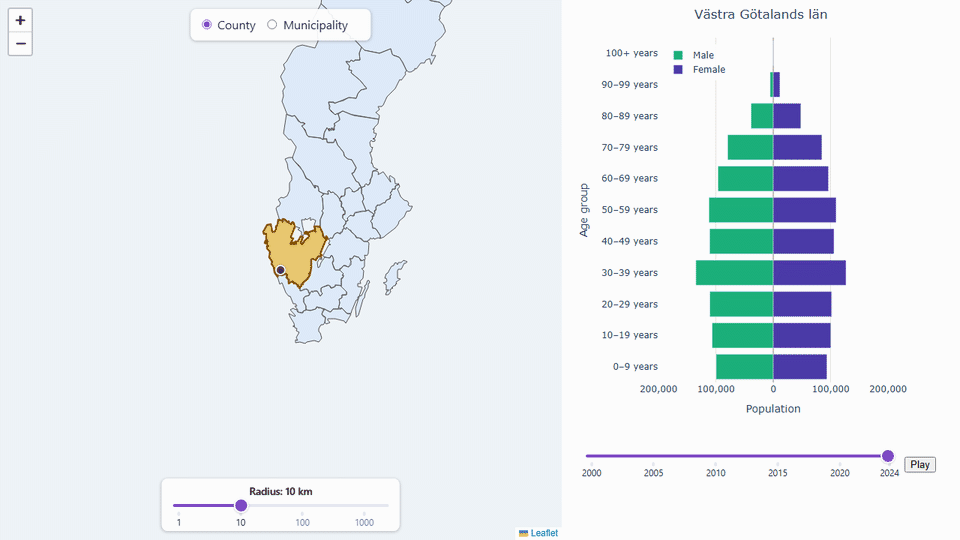

# Sweden Population Explorer

This is a personal project to gain hands-on experience with the full lifecycle of a data project: pulling real-world data from a public API, cleaning and storing it in a relational database, and building an interactive application to explore it geographically. It's achieved by working with two of Statistics Sweden's (SCB) open datasets - population (covering every Swedish municipality, by age and sex, from 2000 onward) and county-to-county internal migration - through a Python/PostgreSQL pipeline and a Dash/Leaflet web application built on top of them.

This project was developed with the assistance of Claude Code.



## Current pipeline

```text
SCB API
   │
   ▼
Python / pandas
   │
   ├── JSON-stat parsing
   ├── Data cleaning
   └── API request batching
   │
   ▼
PostgreSQL
   │
   ▼
SQL queries (queries.py)
   │
   ▼
Plotly figures (visualisation.py)
   │
   ▼
Interactive Dash app (app.py)
```

The current dataset contains monthly population data by Swedish municipality, age group and sex, plus annual county-to-county migration flows by sex.

The project also includes municipality geometry data in GeoJSON format, which is used to connect population data to geographic locations.

## Technologies

* Python
* pandas
* Dash / dash-leaflet
* Plotly
* Shapely
* PostgreSQL
* psycopg
* pytest
* Docker
* GitHub Actions

## Project structure

```text
scb-project/
├── .github/
│   └── workflows/
│       └── ci.yml
├── assets/
│   └── layout.css
├── data/
│   └── municipalities.geojson
├── docs/
│   └── demo.gif
├── src/
│   └── scb_data/
│       ├── database.py
│       ├── geography.py
│       ├── jsonstat.py
│       ├── migration.py
│       ├── population.py
│       ├── queries.py
│       ├── scb_api.py
│       └── visualisation.py
├── tests/
│   ├── conftest.py
│   ├── test_database.py
│   ├── test_geography.py
│   ├── test_jsonstat.py
│   ├── test_migration.py
│   ├── test_population.py
│   ├── test_queries.py
│   ├── test_scb_api.py
│   └── test_visualisation.py
├── app.py
├── Dockerfile
├── compose.yaml
├── pyproject.toml
├── requirements.txt
└── run_pipeline.py
```

## Data source

Both datasets are retrieved from Statistics Sweden (SCB) using the PxWeb API. The pipeline uses two of SCB's tables:

* **Population per month by region, age and sex** - monthly observations covering every Swedish municipality.
* **Internal migration between counties by sex and county** - annual county-to-county moves, used by the app's Migration tab.

Municipality geometry (`data/municipalities.geojson`) comes from a separate source: [okfse/sweden-geojson](https://github.com/okfse/sweden-geojson/tree/master). It's stored separately from the SCB data and is used to connect population/migration figures to geographic locations through municipality and county codes.

## Interactive application

`app.py` is a Dash application for exploring the population data geographically: pan a borders-only map of Sweden to pick a location and radius (or switch to whole counties), then explore that area across three tabs:

* **Population Pyramid** - population by age group and sex, animated across every year of available data.
* **Population Over Time** - a population trend line with a growth-rate projection a few years out.
* **Migration** - who moved to or from the selected area as a Sankey diagram, with a "Moved to"/"Moved from" toggle. Switching to this tab automatically selects county level, since migration data is only available at that granularity.

Run it locally with:

```bash
python app.py
```

## Running locally

### 1. Start PostgreSQL

The project includes a Docker Compose configuration for the database:

```bash
docker compose up -d
```

This starts a PostgreSQL instance with:

```text
Database: scb
User:     scb
Password: development
Host:     localhost
Port:     5432
```

### 2. Install the Python package

Create and activate a virtual environment, then install the project:

```bash
pip install -e .
```

Install the dependencies if necessary:

```bash
pip install -r requirements.txt
```

### 3. Run the pipeline

```bash
python run_pipeline.py
```

This retrieves the configured SCB population and migration data, transforms it, and loads it into PostgreSQL.

### 4. Run the interactive app

```bash
python app.py
```

See [Interactive application](#interactive-application) above.

### 5. Run the tests

```bash
pytest
```

The tests include unit tests for the data-processing, geography, and visualization modules, as well as database integration tests.

The database tests use a separate PostgreSQL database named `scb_test`.

## Continuous integration

GitHub Actions automatically:

1. Checks out the repository.
2. Starts a PostgreSQL service.
3. Builds the Docker image.
4. Runs the test suite inside the Docker container.

The workflow is defined in:

```text
.github/workflows/ci.yml
```

## Status

The project currently provides:

* SCB API integration
* JSON-stat to pandas conversion
* API request batching
* Data cleaning
* PostgreSQL storage
* Municipality GeoJSON data
* An interactive, borders-only map (no street tiles, restricted to Sweden) with a fixed-center selection point and a log-scale radius ring (1-2000 km)
* Radius-based municipality lookup (representative-point distance, with an exact point-in-polygon fallback), highlighted directly on the map
* A municipality/county level selector, grouping the radius search up to whole counties
* A **Population Pyramid** tab (male/female by age group) for the selected area
* A year slider with play/pause, animating through 2000-2024
* A **Population Over Time** tab with a compound-growth-rate projection a few years beyond the available data
* A **Migration** tab showing county-to-county migration flows as a Sankey diagram, with a "Moved to"/"Moved from" toggle
* Unit and database integration tests
* Docker-based test execution
* GitHub Actions CI

## Roadmap

No further items are currently planned.
